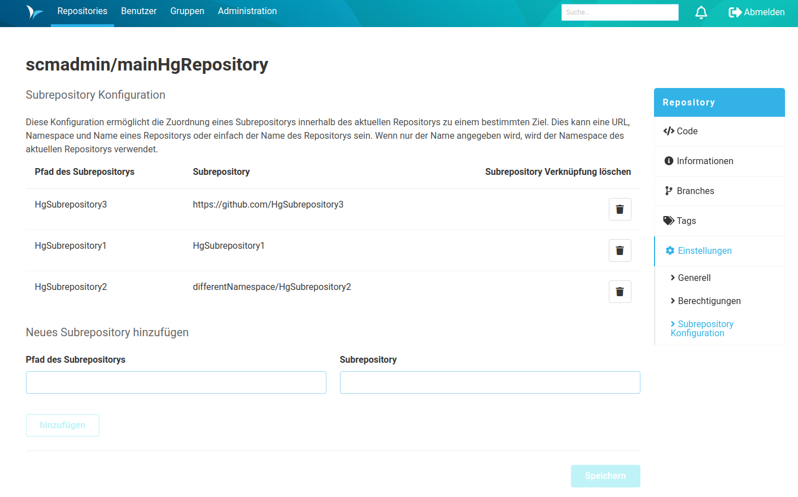

Für die Verwaltung von Subrepositories ist eine Konfiguration erforderlich. Die zu konfigurierenden Alias der Subrepositories werden in den Repository-Einstellungen des übergeordneten Repositorys angelegt. 
Dazu befindet auf der `Repositories` Seite in der rechten Menü-Leiste unter `Einstellungen` der Unterpunkt `Subrepository Konfiguration`.
Die Konfiguration erlaubt es, für jedes Subrepository einen Alias zu setzen.
Dazu muss der Pfad des Subrepositorys, welcher in Bezug auf das übergeordnete Repository angegeben wird, mit dem eigentlichen Pfad des Subrepositorys verknüpft werden.
Dies kann über die Angabe des Namespace und Name des Repositorys im SCM-Manager geschehen oder einfach die Angabe des Namen des Repositorys sein.
Wird nur der Name angegeben, wird der Namespace des Repositorys verwendet, in dem die Einstellungen vorgenommen werden.
Es kann stattdessen auch eine (externe) URL verwendet werden.
Dieser konfigurierte Alias wird dann für hg-Operationen wie pull oder push verwendet.

### Berechtigungen

Jeder, der die Berechtigung hat, das Repository zu lesen, hat auch das Recht, die Konfiguration des Repositorys einzusehen. 
Die Berechtigung `Mercurial Subrepositories konfigurieren` ist erforderlich, um die Konfiguration von Subrepositories zu erstellen und zu bearbeiten.
