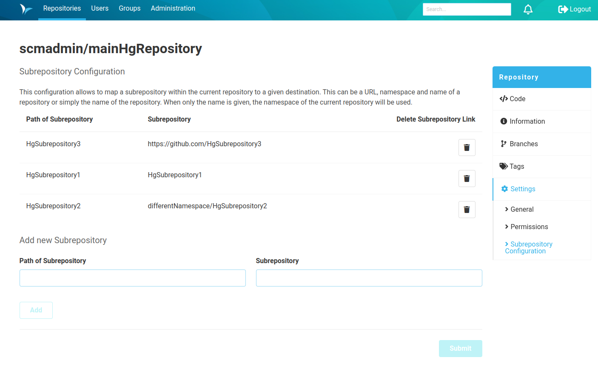

A configuration is required to manage sub-repositories. 
The aliases of the subrepositories to be configured are created in the repository settings of the parent repository. 
For this purpose, the sub-item `Subrepository configuration` is located on the `Repositories` page in the right-hand menu bar under `Settings`.
The configuration allows you to set an alias for each subrepository.
To do this, the path of the subrepository, which is specified in relation to the parent repository, must be linked to the actual path of the subrepository.
This can be done by specifying the namespace and name of the repository in the SCM-Manager or simply by specifying the name of the repository.
If only the name is specified, the namespace of the repository in which the settings are made is used.
An (external) URL can also be used instead.
This configured alias is then used for hg operations such as pull or push.

### Permissions
Anyone who is able to read the repository also has the right to view the subrepository configuration of the repository. 
The `Configure Mercurial Subrepositories` permission is required to create and edit the configuration of subrepositories.
